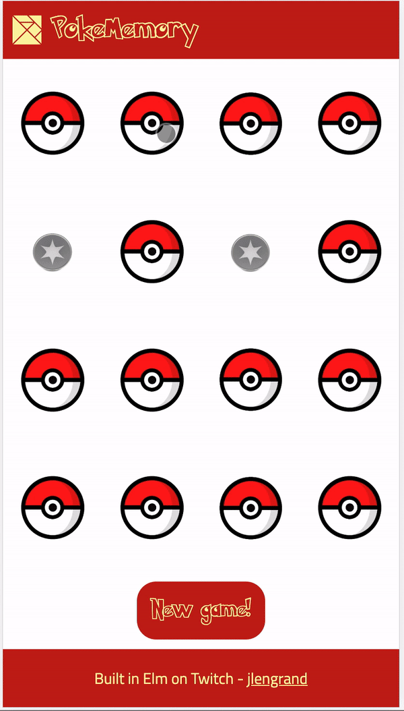

# PokeMemory - [Play the game here!](https://elm-memory.netlify.com)

PokeMemory is a Pokemon based Memory game built in Elm.

Here is a short demo :

## Playing the game

[You can play the game here!](https://elm-memory.netlify.com)

## See how it was made

I built most of this applciation live on Twitch. You can see the streams again in [this Youtube playlist](https://www.youtube.com/watch?v=oPInjDtCmro&list=PLyB9ax65kmeygt9fCmQ3yy3Q6ar5MpUub).

I streamed my journey of learning Elm and Functional Programming. I am a developer, but the level of the videos is pretty basic :).

## Tech

The app is built in [Elm](https://elm-lang.org/).

I used

- [create-elm-app](https://github.com/halfzebra/create-elm-app)
- [Elm-ui](https://package.elm-lang.org/packages/mdgriffith/elm-ui/1.1.5/). (It's amazing. First time ever that I know how to build a UI alone XD).
- [PokeApi](https://pokeapi.co/). That's where the data comes from :).

The game is intended to be a [PWA](https://developers.google.com/web/progressive-web-apps/), which means that it should be possible to play it offline!

## TODOs

A few things are still to be done. You can see the complete list [here](https://github.com/jlengrand/elm-memory/issues).

- Fix the latency bug on first pokemon paint
- Add more pokemons
- Get a real PWA
- Add a win animation :)

The game is in its first MVP version though. It is completely playable :).

## Author

Game created by [Julien Lengrand-Lambert](https://github.com/jlengrand/elm-memory)

Thanks a lot to the folks of the #elm-ui channel for the help to get the website responsive :).

Source code is [here](https://github.com/jlengrand/elm-memory), test current version [here](https://elm-memory.netlify.com).
